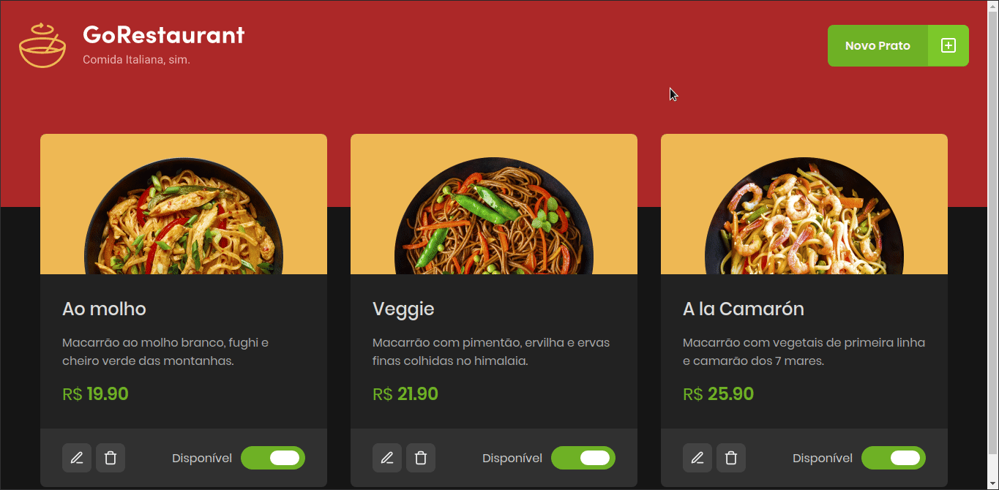
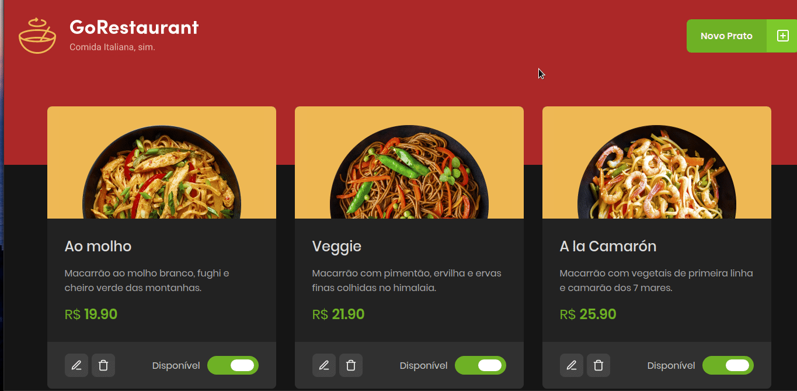

<p align="center">
  
</p>

# GoRestaurant 🍝
Este repositório é referente ao desafio 'CRUD React' do Bootcamp GoStack 11.0, da Rocketseat 🚀.

# Proposta 🔥
Este projeto é um estudo em React para treinar funções básicas de uma aplicação, tais como o CRUD (Create, Read, Update and Delete).
Para tornar o desafio mais complexo, também foi introduzido o isolamento de componentes que executam cada uma das operações e
a definição de tipos mais complexos, utilizando funções como propriedades entre os componentes. O diferencial do meu projeto é o tema
Dark e a responsividade para todos os tipos de tela.

# Resultado 🚀
<p align="center">
  
</p>

# Responsivo 📱
<p align="center">
  
</p>

# Tecnologias Utilizadas 🚀
React ⚛️ <br />
React Modal ⚛️ <br />
Styled-Components 💅🏻 <br />
Jest 🃏 <br />
React Icons ⚛️❤️ <br />
Typescript 🦕

# Testes 🧪
Esse projeto utiliza Jest para realizar os testes E2E.
Para inicializar todos os testes já prepardos, utilize <code> yarn test </code>.

# Como obter esse repositório? 🤔
Para obter esse projeto, siga os passos:
1. Clone esse repositório utilizando <code>git clone</code>.
2. Rode o comando <code> yarn </code> na raíz da pasta do projeto clonado para baixar as dependências.
3. Rode <code>json-server server.json -p 3333</code> na raíz da pasta do projeto para inicializar a Fake API.
4. Rode <code> yarn start </code> na raíz da pasta do projeto para inicializar o servidor.
5. Happy Hacking! 🚀

⚠️ Caso o projeto não mostre os produtos, rode <code>adb reverse tcp:3333 tcp:3333</code> antes de iniciar a Fake API ⚠️

# Como Contribuir? 😍
**Faça um fork deste repositório**

```bash
# Clone o seu fork
$ git clone url-do-seu-fork && cd GoRestaurantWeb

# Crie uma branch com sua feature ou correção de bugs
$ git checkout -b minha-branch

# Faça o commit das suas alterações
$ git commit -m 'minhas alterações'

# Faça o push para a sua branch
$ git push origin minha-branch
```

Delete sua branch, se quiser, quando o merge da sua pull request for feito. <br />

Feito com 💜 por <a href="https://www.linkedin.com/in/andrecampll/" target="blank">andrecampll</a>.
